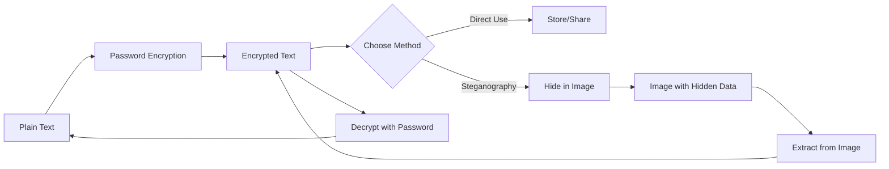

# 🔐 CipherNest

<div align="center">


### A powerful web-based application for secure note-taking that combines encryption and steganography to protect your sensitive information.

[](https://debanga-06.github.io/CipherNest/)
[](https://github.com/Debanga-06/CipherNest/stargazers)
[](https://github.com/Debanga-06/CipherNest/network/members)
[](https://github.com/Debanga-06/CipherNest/issues)
[](LICENSE)


[View Demo](https://debanga-06.github.io/CipherNest/) · [Report Bug](https://github.com/Debanga-06/CipherNest/issues) · [Request Feature](https://github.com/Debanga-06/CipherNest/issues)

</div>

---


## 🌟 Features

<table>
<tr>
<td width="50%">

### 🔒 Encryption
* ✅ **Create Encrypted Notes**: Write notes that are encrypted using your password
* ✅ **Password-Protected**: Only readable with the correct password
* ✅ **Secure Decryption**: Paste your encrypted note and password to decrypt it instantly
* ✅ **Client-Side Processing**: Your data never leaves your device

</td>
<td width="50%">

### 🖼️ Steganography
* ✅ **Hide Messages in Images**: Conceal your encrypted notes inside PNG or JPG images
* ✅ **Multi-Format Support**: Works with both PNG and JPG image formats
* ✅ **Extract Hidden Messages**: Retrieve secret messages from steganography-enabled images
* ✅ **Dual-Layer Security**: Combines encryption with image-based hiding for maximum privacy

</td>
</tr>
</table>

---

## 🚀 Live Demo

Visit the application: **[https://debanga-06.github.io/CipherNest/](CipherNest)**

---

## 📖 How It Works



CipherNest provides **four main functionalities**:

| Feature | Description |
|---------|-------------|
| 🔐 **Encrypt** | Create password-protected encrypted notes |
| 🔓 **Decrypt** | Decode encrypted notes using your password |
| 🖼️ **Hide (Steganography)** | Embed encrypted messages within image files |
| 🔍 **Extract (Steganography)** | Retrieve hidden messages from images |

---

## 🛠️ Technologies Used

<div align="center">

| Technology | Purpose |
|------------|---------|
|  | Structure and Layout |
|  | Styling and Design |
|  | Encryption Logic & Interactivity |
| 🔐 Crypto API | Secure Encryption Algorithms |
| 🎨 Canvas API | Image Processing & Steganography |

</div>

---

## 💡 Use Cases

<table>
<tr>
<td align="center" width="25%">

<br><b>Password Storage</b>
<br>Securely store personal notes and passwords
</td>
<td align="center" width="25%">

<br><b>Secret Messages</b>
<br>Share sensitive information through images
</td>
<td align="center" width="25%">

<br><b>Privacy</b>
<br>Create hidden messages for privacy-conscious communications
</td>
<td align="center" width="25%">

<br><b>Data Protection</b>
<br>Protect confidential data with dual-layer security
</td>
</tr>
</table>

---

## 🔐 Security Features

<div align="center">

| Feature | Description |
|---------|-------------|
| 🔒 **Client-Side Encryption** | Your data never leaves your device unencrypted |
| 🔑 **Password-Based Security** | Personalized encryption using your own password |
| 🖼️ **Steganography Layer** | Additional layer of obscurity through image hiding |
| 🚫 **No Server Storage** | Zero server-side storage of sensitive information |
| 🎯 **Zero-Knowledge Architecture** | Even we cannot access your encrypted data |

</div>

---

## 📝 Usage

### 🔐 Encrypting a Note

1. Navigate to the **Encrypt** section
2. Enter your note text in the text area
3. Create a strong password (remember this!)
4. Click the **Encrypt** button
5. Copy your encrypted note for storage or sharing

---

### 🔓 Decrypting a Note

1. Go to the **Decrypt** section
2. Paste your encrypted note
3. Enter the password you used for encryption
4. Click **Decrypt** to view the original message

---

### 🖼️ Using Steganography

#### To Hide a Message:
1. Upload a PNG or JPG image
2. Paste your encrypted note
3. Click to generate a new image with the hidden message
4. Download the resulting image

#### To Extract a Message:
1. Upload an image containing a hidden message
2. Click **Extract** to retrieve the encrypted note
3. Use the **Decrypt** function to read the original message

---

## 🚀 Getting Started

### Prerequisites

- A modern web browser (Chrome, Firefox, Safari, Edge)
- That's it! No installation required for online use

### Local Development

1. **Clone the repository**
   ```bash
   git clone https://github.com/Debanga-06/CipherNest.git
   ```

2. **Navigate to the project directory**
   ```bash
   cd CipherNest
   ```

3. **Open in browser**
   - Simply open `index.html` in your browser, or
   - Use a local server:
   
   ```bash
   # Using Python
   python -m http.server 8000
   
   # Using Node.js
   npx http-server
   ```

4. **Access the application**
   - Open `http://localhost:8000` in your browser

---

## 🤝 Contributing

Contributions, issues, and feature requests are welcome! 

<details>
<summary><b>How to Contribute</b></summary>

1. Fork the Project
2. Create your Feature Branch (`git checkout -b feature/AmazingFeature`)
3. Commit your Changes (`git commit -m 'Add some AmazingFeature'`)
4. Push to the Branch (`git push origin feature/AmazingFeature`)
5. Open a Pull Request

</details>

<div align="center">

[](https://github.com/Debanga-06/CipherNest/graphs/contributors)

</div>

---

## 📄 License

This project is open source and available under the **MIT License**.

[](LICENSE)

---

## 👨‍💻 Author

<div align="center">

### **Debanga**

[](https://github.com/Debanga-06)
[](https://debanga-06.github.io/CipherNest/)

</div>

---

## ⭐ Show Your Support

<div align="center">

Give a ⭐️ if this project helped you!

[](https://github.com/Debanga-06/CipherNest)
[](https://github.com/Debanga-06)

</div>

---

## ⚠️ Important Notes

> **🔴 Remember Your Password!** 
> 
> There is no password recovery mechanism by design to ensure maximum security. If you forget your password, your encrypted data cannot be recovered.

<div align="center">

### 📊 Project Stats


</div>

---

<div align="center">

**Made with ❤️ by Debanga**

[⬆ Back to Top](#-ciphernest)

</div>
